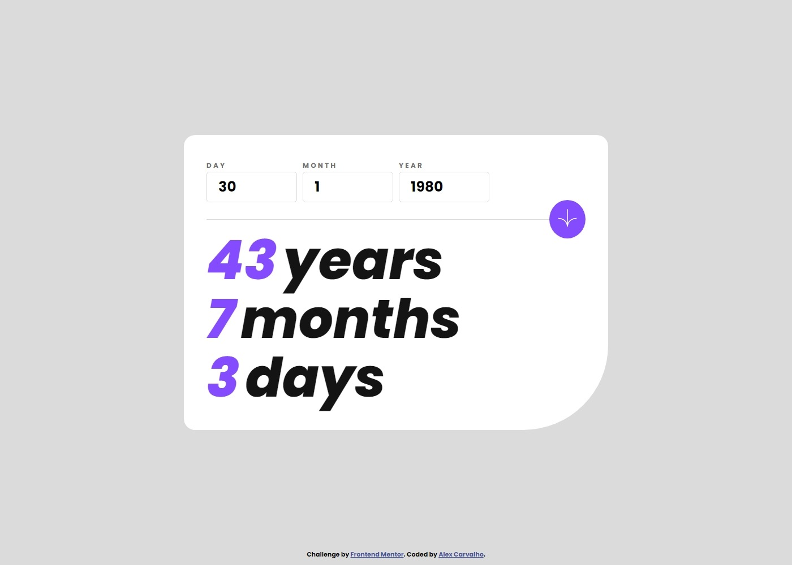

# Frontend Mentor - Age calculator app solution

This is a solution to the [Age calculator app challenge on Frontend Mentor](https://www.frontendmentor.io/challenges/age-calculator-app-dF9DFFpj-Q). Frontend Mentor challenges help you improve your coding skills by building realistic projects. 

## Table of contents

- [Overview](#overview)
  - [The challenge](#the-challenge)
  - [Screenshot](#screenshot)
  - [Links](#links)
- [My process](#my-process)
  - [Built with](#built-with)
  - [What I learned](#what-i-learned)
  - [Continued development](#continued-development)
- [Author](#author)

## Overview

### The challenge

Users should be able to:

- View an age in years, months, and days after submitting a valid date through the form
- Receive validation errors if:
  - Any field is empty when the form is submitted
  - The day number is not between 1-31
  - The month number is not between 1-12
  - The year is in the future
  - The date is invalid e.g. 31/04/1991 (there are 30 days in April)
- View the optimal layout for the interface depending on their device's screen size
- See hover and focus states for all interactive elements on the page
- **Bonus**: See the age numbers animate to their final number when the form is submitted

### Screenshot

#### Desktop

#### Mobile

### Links

- Solution URL: [Github URL](https://github.com/lagercarvalho/frontend-mentor/tree/master/age-calculator)
- Live Site URL: [Live Site URL](https://lagercarvalho.github.io/frontend-mentor/age-calculator/)

## My process

### Built with

- Semantic HTML5 markup
- CSS custom properties
- Flexbox
- JavaScript

### What I learned

This challenge was a bit more involved and more JS intesive. The bonus part of animating the numbers when the form is submitted was very interesting to learn how to do.

### Continued development

I want to get better at being able to tackle JS challenges such as the counter. Also I want to use less markdown and clean up the css file in the future.

## Author

- Website - [Alex Carvalho](https://lagercarvalho.github.io/frontend-mentor/)
- Frontend Mentor - [@lagercarvalho](https://www.frontendmentor.io/profile/lagercarvalho)
