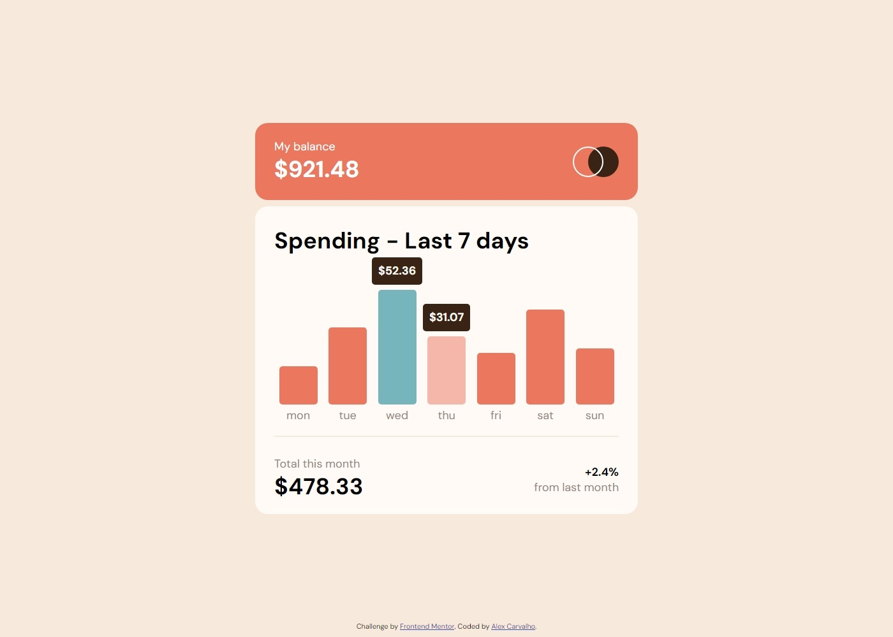
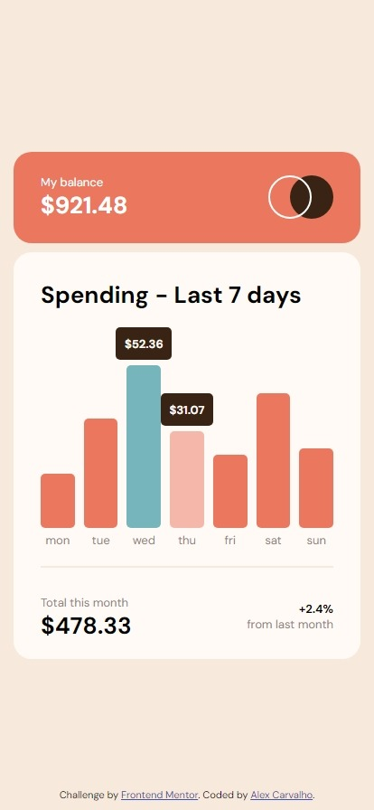

# Frontend Mentor - Expenses chart component solution

This is a solution to the [Expenses chart component challenge on Frontend Mentor](https://www.frontendmentor.io/challenges/expenses-chart-component-e7yJBUdjwt). Frontend Mentor challenges help you improve your coding skills by building realistic projects. 

## Table of contents

- [Overview](#overview)
  - [The challenge](#the-challenge)
  - [Screenshot](#screenshot)
  - [Links](#links)
- [My process](#my-process)
  - [Built with](#built-with)
  - [What I learned](#what-i-learned)
  - [Continued development](#continued-development)
  - [Useful resources](#useful-resources)
- [Author](#author)
- [Acknowledgments](#acknowledgments)

## Overview

### The challenge

Users should be able to:

- View the bar chart and hover over the individual bars to see the correct amounts for each day
- See the current day’s bar highlighted in a different colour to the other bars
- View the optimal layout for the content depending on their device’s screen size
- See hover states for all interactive elements on the page
- **Bonus**: Use the JSON data file provided to dynamically size the bars on the chart

### Screenshot

#### Desktop

#### Mobile

### Links

- Solution URL: [Github URL](https://github.com/lagercarvalho/frontend-mentor/tree/master/expenses-chart)
- Live Site URL: [Add live site URL here](https://your-live-site-url.com)

### Built with

- Semantic HTML5 markup
- CSS custom properties
- Flexbox
- Vanilla JavaScript

### What I learned

In this challenge I built on the JS animation code from the last challenge and modified it to suit my needs in this challenge which I would not have been able to do previously.

### Continued development

As always, the naming conventions are slightly lacking.
Get a better grip of how to use JS files which import some module, had some difficulties with this.

## Author

- Website - [Alex Carvalho](https://lagercarvalho.github.io/frontend-mentor/)
- Frontend Mentor - [@lagercarvalho](https://www.frontendmentor.io/profile/lagercarvalho)
