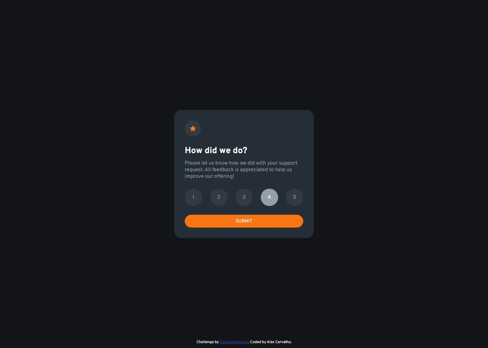

# Frontend Mentor - Interactive rating component solution

This is a solution to the [Interactive rating component challenge on Frontend Mentor](https://www.frontendmentor.io/challenges/interactive-rating-component-koxpeBUmI). Frontend Mentor challenges help you improve your coding skills by building realistic projects. 

## Table of contents

- [Overview](#overview)
  - [The challenge](#the-challenge)
  - [Screenshot](#screenshot)
  - [Links](#links)
- [My process](#my-process)
  - [Built with](#built-with)
  - [What I learned](#what-i-learned)
  - [Continued development](#continued-development)
- [Author](#author)

## Overview

### The challenge

Users should be able to:

- View the optimal layout for the app depending on their device's screen size
- See hover states for all interactive elements on the page
- Select and submit a number rating
- See the "Thank you" card state after submitting a rating

### Screenshot

## Desktop

## Mobile

### Links

- Solution URL: [Github URL](https://github.com/lagercarvalho/frontend-mentor/tree/master/interactive-rating)
- Live Site URL: [Site URL](https://interactive-rating-iota.vercel.app/)

## My process

### Built with

- Semantic HTML5 markup
- CSS custom properties
- Flexbox
- JavaScript

### What I learned

This challenge was my first implementation with javascript and was a great way to get introduced to it. I continued sharpening my skills in css which is feeling easier and easier.

### Continued development

I'm still not entirely happy with the organisation of the css and namings of different classes. This will need some continued work.

## Author

- Frontend Mentor - [@lagercarvalho](https://www.frontendmentor.io/profile/lagercarvalho)

