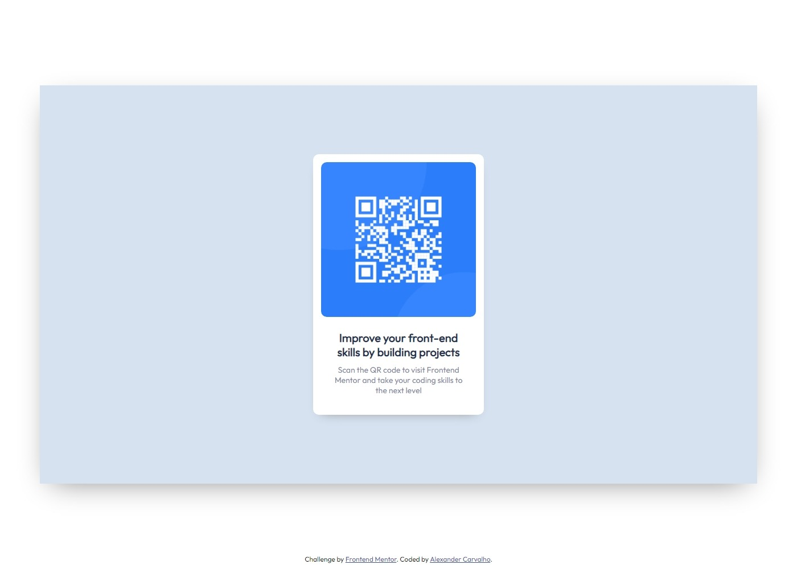

# Frontend Mentor - QR code component solution

This is a solution to the [QR code component challenge on Frontend Mentor](https://www.frontendmentor.io/challenges/qr-code-component-iux_sIO_H). Frontend Mentor challenges help you improve your coding skills by building realistic projects. 

## Table of contents

- [Overview](#overview)
  - [Screenshot](#screenshot)
  - [Links](#links)
- [My process](#my-process)
  - [Built with](#built-with)
  - [What I learned](#what-i-learned)
  - [Continued development](#continued-development)
  - [Useful resources](#useful-resources)
- [Author](#author)
- [Acknowledgments](#acknowledgments)

## Overview

### Screenshots

#### Desktop

#### Mobile

### Links

- Solution URL: [Frontend mentor solution URL](https://www.frontendmentor.io/solutions/responsive-page-using-css-only-EnK1BuHE2s)
- Live Site URL: [Live site URL](https://qr-code-alpha-hazel.vercel.app/)

## My process

### Built with

- Semantic HTML5 markup
- CSS custom properties
- Flexbox
- Mobile-first workflow

### What I learned

This is the first project in css, so i've learnt a lot about everything but specifically flexbox and do's and don'ts in css.

### Continued development

The flexbox work definitely needs improving.

### Useful resources

- [Slaying The Dragon Youtube](https://www.youtube.com/watch?v=phWxA89Dy94) - This helped me a lot to get familiar with flexbox
- [Kevin Powell Youtube](https://www.youtube.com/watch?v=u044iM9xsWU) - Really good YT channel about css

## Author

- Website - [Alexander Carvalho](https://www.your-site.com)
- Frontend Mentor - [@lagercarvalho](https://www.frontendmentor.io/profile/lagercarvalho)
